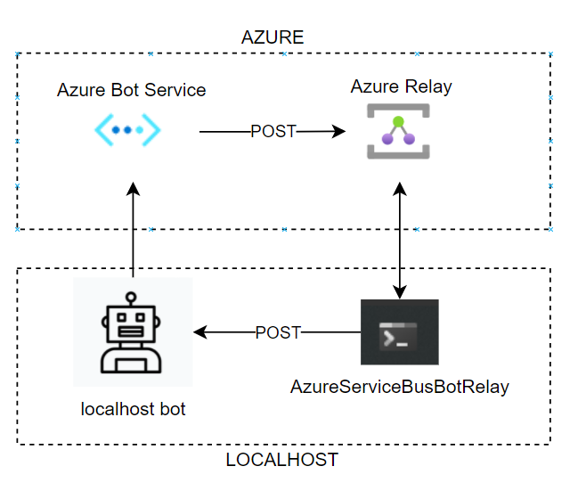

# AzureServiceBusBotRelay

## Overview

A relay utility for bots based on [Azure Relay](https://docs.microsoft.com/en-us/azure/azure-relay/relay-what-is-it).  

This utility allows you to forward a message sent to a bot hosted on any channel to your local machine.

It is useful for debug scenarios or for more complex situations where the BotEmulator is not enough (i.e.: you use the WebChat control hosted on a site and you need to receive ChannelData in your requests or you are testing Teams specific events).

It uses the Azure Relay service along with a small local service to recieve messages from the bot service and forward them to your locally hosted bot. This service can be hosted with the command line tool or installed into your Bot Composer bot as an Adapter package from Nuget.

### Acknowledgments

Part of this code is based on the work that [Pedro Felix](https://github.com/pmhsfelix/WebApi.Explorations.ServiceBusRelayHost) 
and [Gabo Gilbert](https://github.com/gabog/AzureServiceBusBotRelay) have previously done

## Setup

The relay can be used with traditional code based bots or as a simple add in component to Bot Composer

To setup the Azure Bot Service to connect to your local bot you need to

1. Deploy an Azure Relay service
2. Configure your Azure Bot Service to send messages to the Azure Relay 
3. Connect to the relay from Bot Composer

* If you are using a code only bot and not using Bot Composer, once you set up the Azure Service Bus Relay, see the [command line instructions](Docs/Commandline.md) to connect it to your bot)

### Deploy an Azure Relay service

You can use this button to deploy an Azure Relay service with the correct configuration. You will just need to supply it with a unique name for the Azure Service Bus namespace.

After it completes, select the Outputs tab and copy the 5 values. You will need those to configure the bot relay tool and your bot service.

If you want to deploy the relay service manually you will need to

1. ensure the relay does not require authentication
2. add a shared access policy to the hybrid relay that has permission to send & listen

### Configure your Azure Web App Bot or Azure Bot Registration

Before testing the relay, your Azure Web App Bot's messaging endpoint must be updated to match the relay.

1. Login to the Azure portal and open your Web App Bot or Bot Registration.

2. Select **Settings** under Bot management to open the settings blade.

3. In the **Messaging endpoint** field, enter the service bus namespace and relay. This is the "messagingEndpoint" value from the output of the deployment step above.

    Ensure that the URI ends with "/api/messages"

    For example, “https://example-service-bus.servicebus.windows.net/hc1/api/messages".

4. Click **Save** when completed. (You might have to click save twice)

### Connect to the relay from Bot Composer

1. Add the AzureServiceBusRelay package to your bot
2. Enable the bot in the External Connections section and fill in the options from the values captured when you deployed the Azure Service Bus
3. Restart your bot

### Test your bot

1. Test your bot on a channel (Test in Web Chat, Skype, Teams, etc.).
